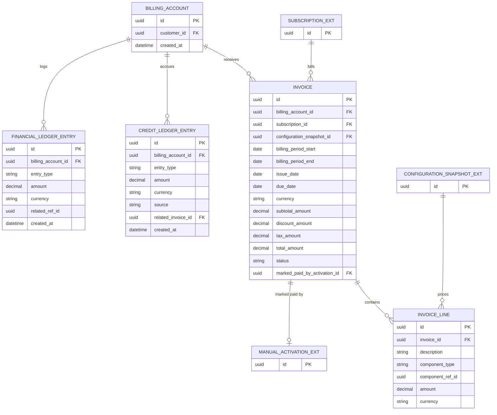

# Commercial Domain Data Model — Billing

**Version:** 0.2 — Rewritten 2026-08-09 to remove payment processing (see notice below)
**Status:** Draft — First Pass, Not Yet Reviewed
**Scope:** Billing bounded context — **Invoice generation only, no payment collection**
**Depends on:** `Commercial Domain Data Model.md` (core spine — Subscription, ConfigurationSnapshot)

---

> ## ⚠️ Scope Correction — 2026-08-09
>
> This platform does not collect payment. Version 0.1 of this document modeled a full in-house payment system (`PaymentMethod`, `Payment`, `Refund`) — that version is superseded. This version keeps only what's needed to generate and track a bill: `BillingAccount` (who is billed), `Invoice`/`InvoiceLine` (what's owed), and `CreditLedgerEntry`/`FinancialLedgerEntry` (bookkeeping adjustments — not money movement). An Invoice is marked **Paid** by a human; that action lives in Subscription Management's Manual Commercial Activation record (`Commercial Domain Data Model.md`, `SUBSCRIPTION_EVENT`), not in this document, since Billing doesn't decide when it's paid — it only reflects that a human said so.

---

# 1. Purpose

Data model for the Billing context as actually scoped for this platform: producing an Invoice and tracking whether it's been marked paid, with no payment method storage, gateway integration, or automated refund transaction.

---

# 2. Diagram

---

# 3. Entity Notes

**`Invoice.status`** is narrowed from the original 8-state model to: `Draft, Issued, Paid, Overdue, Voided`. `Processing`, `Past Due` (as a payment-processing state), and `Uncollectible` are dropped — they described automated payment-provider states that don't exist here. `Overdue` is set when `due_date` passes without the invoice being marked `Paid` (mirrors `SubscriptionManagementArchitecture.md` §29's "Invoice Overdue" trigger).

**`Invoice.marked_paid_by_activation_id`** is the one new field replacing the entire removed Payment subsystem. It's a foreign key to the `ManualActivation`/`SUBSCRIPTION_EVENT` record (owned by Subscription Management, see `Commercial Domain Data Model.md`) that recorded a human marking this invoice paid. Billing stores the pointer; Subscription Management owns the actual actor/reason/timestamp record. This keeps "who said this was paid and why" in one place instead of duplicating it across two contexts.

**`InvoiceLine.component_type`** is unchanged from v0.1 (`BasePlan, CapabilityProfile, CapabilityPack, Capacity, UsageOverage, Discount, Tax`) — this was always about pricing display, not payment, and remains fully applicable.

**`CreditLedgerEntry.source`** is narrowed from v0.1's `RefundConversion, ServiceCompensation, Promotion, ManualAdjustment, MigrationAdjustment` to drop `RefundConversion` (there's no payment to refund). A credit here is purely an invoice-reducing bookkeeping adjustment: `ServiceCompensation, Promotion, ManualAdjustment, MigrationAdjustment`.

**Removed entirely from v0.1:** `PaymentMethod`, `Payment`, `Refund`. Nothing in the current scope replaces them — there is no payment transaction to model.

**`FinancialLedgerEntry.entry_type`** is narrowed to `Invoice, Credit, CreditApplied` — `Payment` and `Refund` entry types are dropped along with the entities they referenced.

---

# 4. Cross-Context Foreign Keys

| Field | Points To | Owning Document | Note |
| --- | --- | --- | --- |
| `Invoice.subscription_id` | Subscription | Core spine | Which commercial relationship this invoice bills |
| `Invoice.configuration_snapshot_id` | ConfigurationSnapshot | Core spine | Pricing Snapshot Principle — invoice reflects the exact snapshot priced, never the live catalog |
| `Invoice.marked_paid_by_activation_id` | Manual Activation record (`SUBSCRIPTION_EVENT`) | Core spine (Subscription Management) | The one link to the "how did this get paid" fact — owned outside Billing |
| `InvoiceLine.component_ref_id` | ProductVersion / CapabilityPack / CapacityDefinition | Core spine | Polymorphic — same convention as the rest of the domain (Decision Brief #10) |
| `BillingAccount.customer_id` | Customer | Identity Domain | Not modeled here |
| `CreditLedgerEntry.source` (when `Promotion`) | AppliedPromotion | Promotion & Discounts data model | Unaffected by this correction — a promotional credit was always a bookkeeping adjustment, not a payment refund |

---

# 5. Modeling Decisions Made While Translating Prose to Schema

1. **Invoice immutability is still enforced by status lifecycle, not by splitting Draft/Final into separate tables** — unchanged from v0.1's reasoning.
2. **`marked_paid_by_activation_id` deliberately does not duplicate actor/reason/timestamp fields on `Invoice` itself.** Subscription Management already owns that record (§27a of `SubscriptionManagementArchitecture.md`); Billing just references it. This avoids the two contexts disagreeing about who marked something paid.
3. **`FinancialLedgerEntry.related_ref_id` remains polymorphic**, now against a smaller set of possible types (`Invoice`, `CreditLedgerEntry`) since `Payment` and `Refund` no longer exist as ledger sources.
4. **No `PaymentMethod`-equivalent entity was added for "how the customer says they'll pay."** If the business ever wants to record a stated payment intention (e.g., "will pay by bank transfer") without processing it, that's a free-text field on `Invoice` or a lightweight note, not a full payment-method entity — flagged here rather than added speculatively.

---

# 6. Fields Resolved / Corrected

| Field / Entity | Resolution | Source |
| --- | --- | --- |
| `PaymentMethod`, `Payment`, `Refund` entities | **Removed** — no payment processing in this platform | 2026-08-09 correction |
| `Invoice.status` enum | **Narrowed** to `Draft, Issued, Paid, Overdue, Voided` | 2026-08-09 correction |
| `Invoice.marked_paid_by_activation_id` | **Added** — the sole link to the manual-payment-confirmation fact | 2026-08-09 correction |
| `Invoice.currency` / single-currency V1 scope | Confirmed | Decision Brief #9 |
| `InvoiceLine.component_ref_id`, `FinancialLedgerEntry.related_ref_id` polymorphic FKs | Accepted | Decision Brief #10 |

---

# 7. Explicitly Not Modeled

* Any payment processing, payment method storage, or payment gateway integration — out of scope entirely, not deferred.
* Tax calculation service integration (`tax_amount` is a field here; the calculation logic, if automated at all, is an external service or manual entry).
* A dedicated Tax bounded context (explicitly deferred, `CommercialDomainIntegrationArchitecture.md` §99).

---

# 8. Status

**Draft — corrected 2026-08-09.** This is now consistent with `SubscriptionManagementArchitecture.md` §27a and the Reference Architecture's §28 correction note. Recommend a final proofread against those two documents together before implementation, since this correction touched all three.
