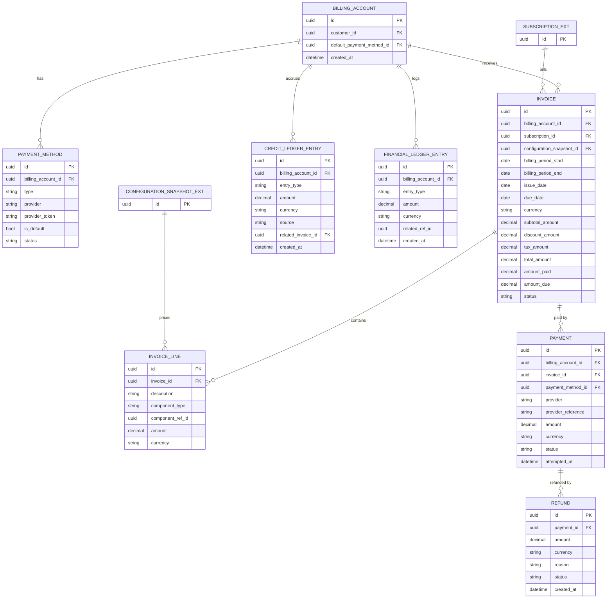

# Commercial Domain Data Model — Billing

**Version:** 0.1
**Status:** Draft — First Pass, Not Yet Reviewed
**Scope:** Billing bounded context
**Depends on:** `Commercial Domain Data Model.md` (core spine — Subscription, ConfigurationSnapshot)

---

# 1. Purpose

Second data-model pass, following the pattern established in the core-spine document: diagram, entity tables, boundary foreign keys, modeling decisions made where the source document didn't specify, and open items. Source: `BillingArchitecture.md`.

---

# 2. Diagram

---

# 3. Entity Notes

**`Invoice.status`** follows `BillingArchitecture.md` §11: `Draft, Open, Processing, Paid, PartiallyPaid, PastDue, Voided, Uncollectible`. Per BIL-001/BIL-005, once an invoice leaves `Draft`, its `InvoiceLine` rows must not be edited — enforced at the application layer, not by a separate table, since splitting "draft invoice" and "finalized invoice" into different tables would complicate every downstream query for no structural benefit.

**`Payment.status`** follows §19: `Pending, Processing, Succeeded, Failed, RequiresAction, Refunded, PartiallyRefunded, Cancelled`.

**`Payment.provider_reference`** should carry a **database-level unique constraint**, not just application-level dedup logic. §53 states webhook processing "must be idempotent" and a customer "must never be charged or credited multiple times" — a unique index makes that structurally true rather than dependent on every code path remembering to check.

**`CreditLedgerEntry.source`** follows §30: `RefundConversion, ServiceCompensation, Promotion, ManualAdjustment, MigrationAdjustment`.

**`InvoiceLine.component_type`** follows the recommended invoice structure in §66: `BasePlan, CapabilityProfile, CapabilityPack, Capacity, UsageOverage, Discount, Tax`. `component_ref_id` is polymorphic against whichever catalog entity produced the line (see §4).

---

# 4. Cross-Context Foreign Keys

| Field | Points To | Owning Document | Note |
| --- | --- | --- | --- |
| `Invoice.subscription_id` | Subscription | Core spine (`Commercial Domain Data Model.md`) | Which commercial relationship this invoice bills |
| `Invoice.configuration_snapshot_id` | ConfigurationSnapshot | Core spine | Pricing Snapshot Principle, §13–14 — the invoice must reference the exact snapshot priced, never re-derive from the live catalog |
| `InvoiceLine.component_ref_id` | ProductVersion / CapabilityPack / CapacityDefinition (by `component_type`) | Core spine | Polymorphic — same modeling caveat as the core spine's `Entitlement.source_ref_id` |
| `BillingAccount.customer_id` | Customer | Identity Domain | Not modeled here |
| `CreditLedgerEntry.source` (when `Promotion`) | AppliedPromotion | Promotion & Discounts data model | See that document |

---

# 5. Modeling Decisions Made While Translating Prose to Schema

1. **Invoice immutability is enforced by status lifecycle, not by splitting Draft/Final into separate tables.** A separate `InvoiceDraft` table was considered and rejected — it would double every downstream query (billing history, dunning, analytics) for a distinction that a status check already provides.
2. **`FinancialLedgerEntry.related_ref_id` is polymorphic**, exactly the same pattern (and the same caveat) as `Entitlement.source_ref_id` in the core spine document. These two polymorphic-FK decisions should be reviewed together as one architectural choice, not separately — if the team decides polymorphic FKs are unacceptable in one place, the same decision should apply to the other.
3. **Refund is modeled as its own entity, not a `Payment` status alone.** A refund needs an independent reason and status lifecycle (§32–33), and partial refunds require an amount that differs from the original payment amount — collapsing them into a `Payment.status = Refunded` flag would lose that.
4. **`CreditLedgerEntry` and `FinancialLedgerEntry` are kept as two entities, not one.** `CreditLedgerEntry` tracks the customer-facing credit balance (§31, a subset of the story); `FinancialLedgerEntry` is the complete audit trail across invoices, payments, credits, and refunds (§48). Merging them would force the complete audit ledger to only contain credit-related rows or force credit-specific queries to filter a much larger table — kept separate for now, but this should be revisited if it proves to be duplicated bookkeeping in practice.

---

# 6. Fields Pending Decision Brief Sign-off

| Field / Entity | Depends On | Decision Brief Item |
| --- | --- | --- |
| `Invoice.currency` / `Payment.currency` scope (single currency only at launch) | Multi-currency deferral | #9 |
| Whether any `InvoiceLine.component_type` needs an `EnterpriseNegotiatedTerm` variant | Enterprise contracts out of V1 | #7 |

No other fields in this document are blocked — Billing's V1 support list (Monthly/Annual, Fixed Plans, Design Your Plan, card payment, proration, credits, refunds, grace period) is already explicit in `BillingArchitecture.md` §65 and carried into `Commercial Domain V1 Scope.md` §2.6 without ambiguity.

---

# 7. Explicitly Not Modeled in This Pass

* Tax calculation service integration (`tax_amount` is a field here; the calculation logic is an external service per §34)
* Payment provider webhook payload schema (provider-specific, not part of the domain model)
* Dunning/retry schedule configuration (§21 — policy configuration, not a new entity)
* A dedicated Tax bounded context (explicitly deferred, `CommercialDomainIntegrationArchitecture.md` §99)

---

# 8. Status

**Draft — First Pass.** Pending review alongside the core spine document and `Commercial Domain Decision Brief.md`.
