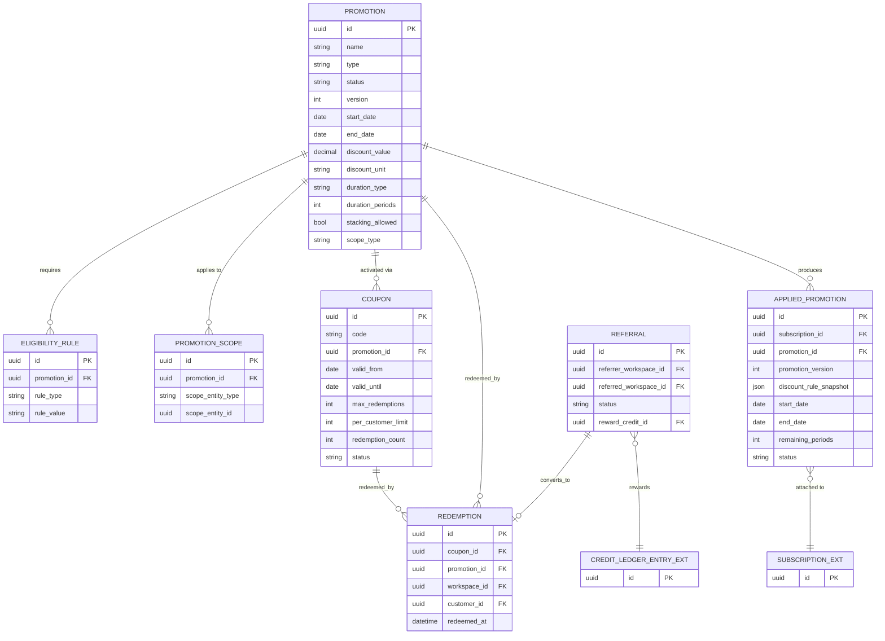

# Commercial Domain Data Model — Promotion & Discounts

**Version:** 0.1
**Status:** Draft — First Pass, Not Yet Reviewed
**Scope:** Promotion & Discounts bounded context
**Depends on:** `Commercial Domain Data Model.md` (core spine — Subscription, ConfigurationSnapshot, Entitlement), `Commercial Domain Data Model — Billing.md` (CreditLedgerEntry)

---

# 1. Purpose

Fourth and final data-model pass for this round, completing coverage of the contexts identified in the core spine document's §8. Source: `PromotionAndDiscountArchitecture.md`.

---

# 2. Diagram

---

# 3. Entity Notes

**`Promotion.type`** follows §10: `Percentage, FixedAmount, IntroductoryPrice, FreeTrial, FreePeriod, Credit, BundleDiscount, AnnualDiscount, ReferralReward, TargetedOffer`.

**`Promotion.status`** follows §9: `Draft, Scheduled, Active, Suspended, Expired, Archived`.

**`Promotion.stacking_allowed`** defaults to `false`. This is not an open item — §27 already states the recommended policy explicitly: "No stacking by default. Selected promotions may explicitly allow stacking." Listed here as a resolved default, not something pending sign-off.

**`Promotion.scope_type`** follows §58–59: `SubscriptionWide, ProductSpecific, ComponentSpecific` — this determines whether a discount survives an upgrade (§58: subscription-wide promotions may continue; product-specific ones may not).

**`Coupon` and `Promotion` are deliberately separate entities.** §17 is explicit: "the coupon itself does not define the discount rules." A `Coupon` is purely a redemption/activation mechanism (code, validity window, redemption limits) pointing at a `Promotion`, which owns the actual discount and eligibility logic.

**`AppliedPromotion.discount_rule_snapshot`** is a denormalized JSON copy of the discount terms at the moment the promotion was applied, not just a versioned pointer. This directly implements PRO-003 ("applied promotion terms must be historically preserved") and §43's worked example: if `WELCOME20` later changes from 20% to 10%, a customer's existing 20% must not silently change. A pointer-plus-version alone would only protect this if every future reader remembered to resolve historical versions correctly; the snapshot makes the protection structural.

**`Redemption` is modeled independently of `AppliedPromotion`.** A redemption can occur without producing a recurring subscription-attached promotion — e.g., a one-time referral credit redemption never becomes an `AppliedPromotion` row at all, it only produces a `CreditLedgerEntry` (Billing) via `Referral`.

---

# 4. Cross-Context Foreign Keys

| Field | Points To | Owning Document | Note |
| --- | --- | --- | --- |
| `AppliedPromotion.subscription_id` | Subscription | Core spine | The commercial relationship the promotion is attached to |
| `Redemption.workspace_id` / `customer_id` | Workspace / Customer | Workspace / Identity Domain | Not modeled here |
| `Referral.reward_credit_id` | CreditLedgerEntry | Billing data model | Referral rewards become financial credits, not entitlement or configuration changes (§36) |
| Referenced *from* elsewhere: `ConfigurationSnapshot.promotion_id`, `Entitlement.source_ref_id` (when `source = Promotion`), `CreditLedgerEntry.source` (when `Promotion`) | `AppliedPromotion` (this document) | Core spine / Billing | This document is the target of those foreign keys, not the source |

---

# 5. Modeling Decisions Made While Translating Prose to Schema

1. **`PromotionScope` is a generic join** (`scope_entity_type` + `scope_entity_id`) rather than separate join tables per scope target (product, capability domain, pack, billing cycle). §24 lists several possible scope targets; a generic scope table avoids five near-identical join tables, at the cost of the same polymorphic-FK caveat raised for `Entitlement.source_ref_id` and `FinancialLedgerEntry.related_ref_id` elsewhere in this document set. All three polymorphic decisions should be reviewed as one architectural choice.
2. **`Referral` is modeled as its own entity rather than a `Promotion` subtype**, because a referral has a two-sided outcome (referrer credit + referred-customer discount, §35) that doesn't fit the single-recipient shape of `AppliedPromotion`.
3. **`Coupon.code` should carry a database-level unique constraint**, and per §49, codes intended for private/targeted offers should not be sequential or guessable — this is a generation-policy note, not a schema field, but worth carrying forward since it affects how the code is generated, not just stored.

---

# 6. Fields Pending Decision Brief Sign-off

None. Every V1-relevant item in this document (which promotion types, which rules, no-stacking-by-default) is already explicitly resolved in `PromotionAndDiscountArchitecture.md` §73 and carried into `Commercial Domain V1 Scope.md` §2.7. This is the one context of the four modeled so far with no open scope questions — worth noting as a positive signal about how well-specified that source document already was.

---

# 7. Explicitly Not Modeled in This Pass

* Promotion analytics/performance reporting (§50–51 — belongs to Commercial Analytics, not yet written)
* Fraud/abuse detection logic for redemption (§48 — a rule engine concern, not a schema element)
* Tax treatment of promotional credits (depends on the Billing document's tax handling, itself deferred)

---

# 8. Status

**Draft — First Pass.** This completes the first modeling pass across all four contexts identified in the core spine document (`Commercial Domain Data Model.md` §8: Billing, Usage & Metering, Promotion & Discounts, now all drafted). Recommend a single consolidated review across all four data-model documents together, since three of them independently raised the same polymorphic-foreign-key question — that pattern should be resolved once, as a shared convention, rather than three times.
