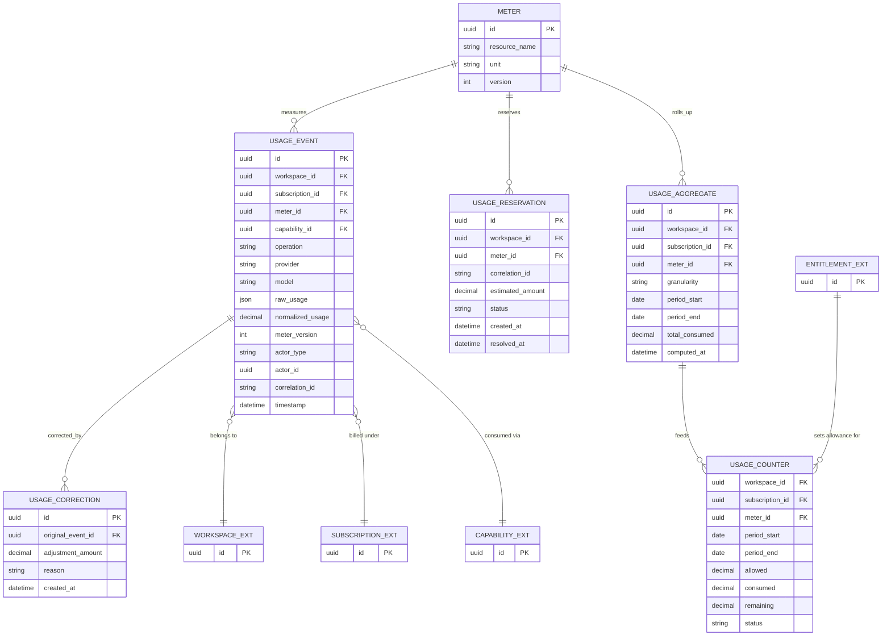

# Commercial Domain Data Model — Usage & Metering

**Version:** 0.1
**Status:** Draft — First Pass, Not Yet Reviewed
**Scope:** Usage & Metering bounded context
**Depends on:** `Commercial Domain Data Model.md` (core spine — Subscription, Capability, Entitlement)

---

# 1. Purpose

Third data-model pass, same pattern as the previous two. Source: `UsageAndMeteringArchitecture.md`. This is the highest-write-volume context in the domain (every AI operation produces at least one event), so the modeling decisions here lean toward append-only, idempotent, and explicitly non-authoritative-counter patterns — consistent with the document's own repeated warning against relying on a mutable counter as the source of truth.

---

# 2. Diagram

---

# 3. Entity Notes

**`UsageEvent` is insert-only.** Nothing about a usage event is ever updated after creation — corrections are separate rows in `UsageCorrection`, never in-place edits (USG-004, USG-005, §33: "Corrections should never silently modify historical events").

**`UsageEvent.correlation_id` requires a database-level unique constraint.** USG-003 mandates idempotency; §16 states "the same event should never be counted twice." This should be a structural guarantee, not an application-level check — the same reasoning applied to `Entitlement.source` precedence and the other domain-wide invariants ratified in the Decision Brief.

**`UsageEvent.meter_version`** is stored on every row, denormalized from `Meter.version` at write time, per §35–36 — historical events must remain reprocessable under the meter-conversion rule that was active when they occurred, even after `Meter.version` advances.

**`UsageCounter` is a materialized read model, not a write target.** Nothing writes to it directly; it is recomputed from `UsageAggregate`, which is itself recomputed from `UsageEvent`. This directly implements §32's explicit instruction: "Do not rely only on a mutable counter... event history is required." `UsageCounter.allowed` is not owned by this context at all — it is read from the `Entitlement` row (core spine, Licensing) where `entitlement_type = UsageAllowance`; Usage & Metering measures consumption, it does not decide allowances (§55).

**`UsageCounter.status`** follows §20: `Normal, Warning, NearLimit, Exhausted, OverLimit, Unlimited`.

**`UsageReservation`** exists so a requested-but-not-yet-executed AI operation can pre-check against remaining allowance (§23) without being counted as consumption until it either commits (becomes a `UsageEvent`) or is released.

---

# 4. Cross-Context Foreign Keys

| Field | Points To | Owning Document | Note |
| --- | --- | --- | --- |
| `UsageEvent.workspace_id` | Workspace | Workspace Domain | Not modeled here |
| `UsageEvent.subscription_id` | Subscription | Core spine | Aligns usage to the correct billing period |
| `UsageEvent.capability_id` | Capability | Core spine (Product Management) | Enables the AI Capability Usage Matrix reporting from §27 |
| `UsageCounter.allowed` (derivation) | Entitlement (`entitlement_type = UsageAllowance`) | Core spine (Licensing) | Usage never defines the allowance, only reads it |

---

# 5. Modeling Decisions Made While Translating Prose to Schema

1. **`UsageAggregate` and `UsageCounter` are two separate materialized entities**, not one. `UsageAggregate` stores rollups at multiple granularities (daily, monthly, subscription-period — §31) for analytics and audit; `UsageCounter` is a single current-period row per workspace/meter optimized for the "how much is left" read that gates every AI operation. Merging them would force the hot-path allowance check to scan historical rollups.
2. **`UsageReservation` is a separate table from `UsageEvent`**, not a status on the event, because a reservation may never convert into an actual event (released, §24) — treating them as one entity would conflate "intent to consume" with "actually consumed," which §25 explicitly treats as different concepts (Estimated vs. Actual usage).
3. **`UsageEvent.actor_type`/`actor_id`** are included even though not strictly required for billing, because §46–47 anticipate AI agents performing many operations on a tutor's behalf and explicitly require that "all resulting consumption must be attributable to the original request" — omitting actor attribution now would be expensive to retrofit once agent-initiated usage exists.

---

# 6. Fields Resolved / Still Open (Decision Brief, 2026-08-09)

**Which `Meter` rows are seeded at launch** was never actually open — `UsageAndMeteringArchitecture.md` §7 already answers this at P0/P1/P2 granularity (AI Credits = P0; Video Processing, Storage, Student/Tutor Seats = P1/optional; Email, SMS = P2/deferred), carried forward unchanged into `Commercial Domain V1 Scope.md` §2.5.

**Throughput/latency target — provisional placeholder set 2026-08-09 (Decision Brief #11 / OD-006).**

> ⚠️ **This is a derived placeholder, not measured traffic data. Replace once real signup/usage numbers exist (e.g., after a beta cohort or shortly after launch).**

**Basis:** launch scale of "hundreds" of workspaces (200–500 used for this calculation) × the heaviest usage scenario already documented in `Product Advisory Architecture.md` §30/§77 (up to ~60 lesson/assessment creations per month for one active tutor), expanded to ~5–10 AI usage events per workspace per day to account for correlated child operations (§46–48 — a single "generate lesson from video" request produces several usage events, not one).

| Target | Value | Derivation |
| --- | --- | --- |
| Sustained write volume | ~1,000–5,000 usage events/day platform-wide | 200–500 workspaces × 5–10 events/workspace/day |
| Peak write throughput (design target) | ~5 events/second sustained, headroom to ~20/second | Accounts for traffic bunching into active hours and correlated multi-event bursts from a single AI workflow; 20/sec headroom covers 5–10x growth without redesign |
| Reservation/pre-check latency | Under ~1–2 seconds | Short delay acceptable; the AI operation itself (generation, transcription) already takes several seconds, so the eligibility check isn't the bottleneck |
| Usage counter freshness | Eventual consistency within ~60 seconds | Async usage counting approved — supports ingest-then-aggregate rather than synchronous per-event counter updates |

**Engineering implication:** at this scale, a simple async pipeline (append `UsageEvent` rows, aggregate into `UsageCounter` on a short interval, e.g. every 30–60 seconds) is sufficient. Nothing here justifies a high-throughput streaming platform at launch — but nothing in the schema should hard-code an assumption that would block scaling to thousands of workspaces later.

---

# 7. Explicitly Not Modeled in This Pass

* Anomaly detection scoring logic (§44 — a computed capability, not a schema element)
* Usage forecasting algorithm (§50 — same)
* The AI Credit Calculator's provider-cost-to-credit conversion formula (§10–11 — business logic, not structure; `Meter.version` is the schema hook for it)

---

# 8. Status

**Draft — provisional throughput/latency target set 2026-08-09 (see §6). Not blocked, but not final.** This document is now clear to proceed to implementation planning using the placeholder in §6. Treat the placeholder as a working assumption, not a validated commitment — revisit it against real telemetry before or shortly after launch, since this context handles every AI operation in the platform and is the most sensitive to being wrong about scale.
