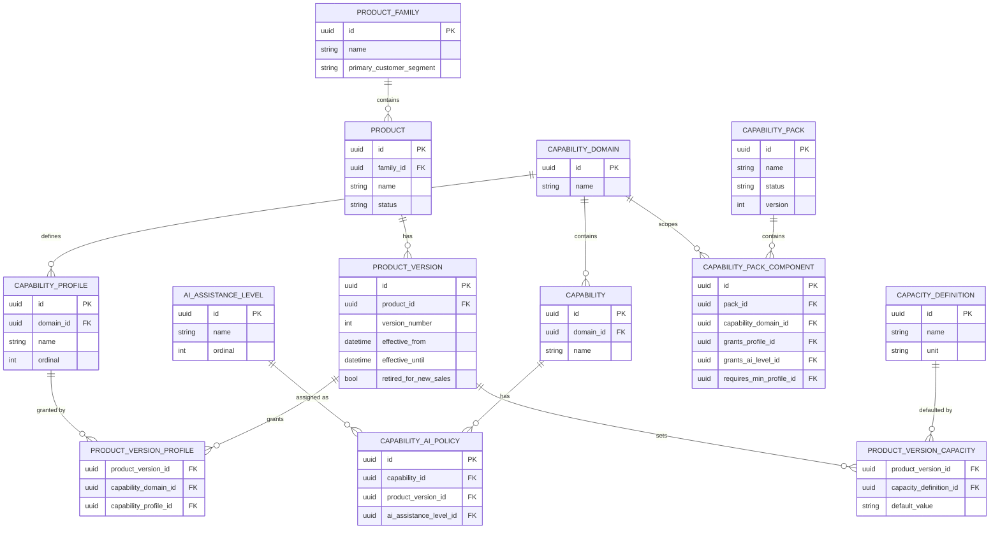
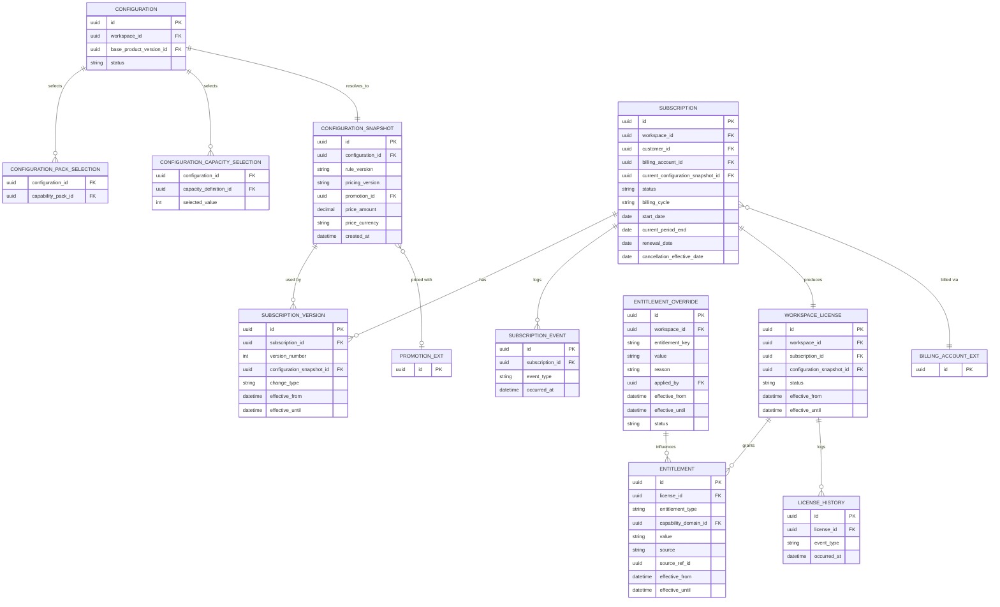

# Commercial Domain Data Model — Core Commercial Spine

**Version:** 0.1
**Status:** Draft — First Pass, Not Yet Reviewed
**Scope:** Product Management → Product Configuration → Subscription → Licensing & Entitlements
**Out of scope for this pass:** Billing, Usage & Metering, and Promotion & Discounts are shown only as referenced boundary entities (enough to complete the foreign keys below). Each deserves its own data-model document; modeling all eight contexts in one pass would make this unreviewable.

---

# 1. Purpose

Every Commercial Domain document describes its aggregates in prose (`License → License ID, Workspace ID...`) rather than as a real schema. This document is the first translation of that prose into entities, fields, keys, and relationships for the four bounded contexts that form the core commercial spine: **what can we sell → what did they choose → what did they commit to → what can they use.**

This is a **first pass**, not an approved schema. Several fields are explicitly marked pending sign-off against `Commercial Domain Decision Brief.md`, and a handful of modeling choices were made to translate prose into a schema where the source documents didn't specify one — those are called out separately in §6 so they can be reviewed rather than silently assumed.

---

# 2. Modeling Conventions

* All primary keys are `id` (UUID) unless noted.
* Money is modeled as `(amount, currency)`, not a bare decimal — per `CommercialDomainIntegrationArchitecture.md` §98, so the schema doesn't need to change shape when multi-currency ships later even though V1 is single-currency.
* Entities described in the source documents as **immutable snapshots** (`ConfigurationSnapshot`, `SubscriptionVersion`) are modeled as insert-only — no update path, only new rows — per CPR-008, SUB-003, and LIC-007.
* Entities described as **append-only history** (`SubscriptionEvent`, `LicenseHistory`) are event logs, not mutable state.
* Entities outside this pass's scope (Billing, Usage, Promotion) are marked **(external)** and shown only where a foreign key crosses the boundary.

---

# 3. Diagram — Catalog (Product Management)

---

# 4. Diagram — Commercial Spine (Configuration → Subscription → License → Entitlement)

---

# 5. Cross-Context Foreign Key Summary

| Field | Points To | Owning Context | In Scope Here? |
| --- | --- | --- | --- |
| `Configuration.workspace_id` | Workspace | Workspace Domain | External |
| `Subscription.customer_id` | Customer | Identity Domain | External |
| `Subscription.billing_account_id` | BillingAccount | Billing | External |
| `ConfigurationSnapshot.promotion_id` | Promotion | Promotion & Discounts | External |
| `Entitlement.source_ref_id` (when source = Promotion) | AppliedPromotion | Promotion & Discounts | External |
| `ConfigurationCapacitySelection` / `Entitlement` usage-type rows | Meter / UsageCounter | Usage & Metering | External |
| `EntitlementOverride.applied_by` | User/Actor | Identity Domain | External |

No table in this document is a second source of truth for an externally-owned entity — these are foreign keys only, matching the Source of Truth Matrix already defined in `CommercialDomainIntegrationArchitecture.md` §7.

---

# 6. Modeling Decisions Made While Translating Prose to Schema

These weren't specified by any source document; they're reasonable defaults chosen to produce a workable schema, and should be explicitly reviewed rather than assumed correct:

1. **`Entitlement.source_ref_id` is polymorphic** (its meaning depends on `source`: a Product Version, a Capability Pack, a Promotion, or an Entitlement Override). This is the simplest way to model "one of several possible sources," but polymorphic associations are harder to enforce referential integrity on in most relational databases. An alternative is four nullable FK columns instead of one polymorphic pair — worth a decision before implementation, not a modeling detail to skip past.
2. **`CapabilityProfile.ordinal` is scoped per domain, not global**, because the Reference Architecture explicitly states profiles "do not necessarily need identical names across domains" (§9) — Collaboration's `Solo → Solo+ → Team → Organization` and Assessment's `Foundation → Professional → AI+` are different ordinal scales that must never be compared to each other.
3. **`ConfigurationSnapshot` and `SubscriptionVersion` are insert-only tables**, not soft-deleted/updated rows, to satisfy the immutability invariants (CPR-008, SUB-003) without relying on application code to enforce it.
4. **Capacity is stored as a string `default_value`/`selected_value`** rather than a strict integer, to accommodate the `"Unlimited"` sentinel used throughout the catalog (e.g., Academy tutor capacity) without a separate nullable "is unlimited" flag. This is a minor call but affects every capacity-reading query, so it's flagged rather than hidden.

---

# 7. Fields Pending Decision Brief Sign-off

| Field / Entity | Depends On | Decision Brief Item |
| --- | --- | --- |
| `Entitlement.source` precedence logic (Override > Promotion > Pack > Base) | Ratification of the precedence rule | #1 |
| Whether `PRODUCT_FAMILY` needs `Studio`/`Academy` rows populated at launch vs. structurally present but unpublished | Studio/Academy V1 inclusion | #2 |
| Which `CAPABILITY_PACK` rows are seeded at launch | Capability Pack launch list | #3 |
| Whether `Subscription.status` needs to support `Paused`/`Resume` transitions in V1 | Pause/Resume scope | #4 |
| Whether `ENTITLEMENT_OVERRIDE` ships in V1 or is deferred | Entitlement Overrides scope | #5 |
| Whether `Subscription.billing_cycle` enum includes `Quarterly`/`Custom` at launch | Billing cycle scope | (V1 Scope §2.3) |

---

# 8. Explicitly Not Modeled in This Pass

* Billing (`Invoice`, `Payment`, `CreditLedgerEntry`, `BillingAccount` internals) — now modeled in `Commercial Domain Data Model — Billing.md`
* Usage & Metering (`Meter`, `UsageEvent`, `UsageCounter` internals) — now modeled in `Commercial Domain Data Model — Usage & Metering.md`
* Promotion & Discounts (`Promotion`, `Coupon`, `Redemption`, `AppliedPromotion` internals) — now modeled in `Commercial Domain Data Model — Promotion & Discounts.md`

All four documents independently arrived at the same modeling question — a polymorphic foreign key for "this entitlement/ledger-entry/scope came from one of several possible source types" (`Entitlement.source_ref_id`, `FinancialLedgerEntry.related_ref_id`, `InvoiceLine.component_ref_id`, `PromotionScope`'s generic join). That recurrence across four independently modeled contexts is a signal, not a coincidence — it should be resolved once, as a shared data-modeling convention, rather than reviewed separately in each document.

---

# 9. Status

**Draft — First Pass.** Has not been reviewed by engineering or validated against the Decision Brief. Next step: review against `Commercial Domain Decision Brief.md`, resolve §7, then proceed to model Billing, Usage & Metering, and Promotion & Discounts using the same pattern.
